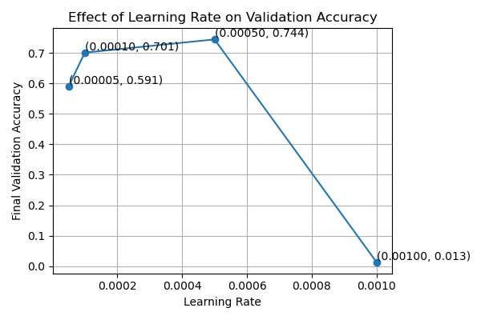

# AI_final_project_team_63

## Overview

A **transformer** model designed to generate music, after given input of (Genre, Emotion). The output music file would be a MIDI file. Refer to [Usage](#usage) on how to use the files to generate music.


Refer to our [Google Slides](https://docs.google.com/presentation/d/e/2PACX-1vRye91epbzfFQgnYlKF1iHZZbxV7mh7DlGTLteW9rpLEs31Ju5p5e9he-P9a962yd7mMfUnjSKN9fRk/pubembed?start=false&loop=false&delayms=3000) for more thorough introduction  


Some sample output music(MIDI files, and also the converted to mp3 versions) are also included in the sample_outputs folder to showcase what the generated music would look like.

The pretrained model is trained with the dataset [XMIDI Dataset](https://github.com/xmusic-project/XMIDI_Dataset).  

Due to GitHub’s file size limit (100 MB), the pre-trained model weights (.pt file) are not included directly in this repository.
You can download the latest pre-trained checkpoint from [Google Drive](https://drive.google.com/file/d/14Rh36449k1q-GCYr6y2LQcO_slwkMd4U/view?usp=sharing):

After downloading, please place the file in your directory (next to generate.py)


## Prerequisite

- Coding Environment:
  
  - OS: Windows 11
  - Python 3.13.2
    
- Package Versions:
  
Run the following command to install the required packages:

```
pip install -r requirements.txt
```

## Usage

Download and install packages
```
git clone https://github.com/Hsiu727/AI_final_project_team_63.git
cd AI_final_project_team_63
pip install -r requirements.txt
```

- **To generate music**  

1. The trained model **"best_model.py"**, the tokenizer **"tokenizer.json"**, the emotion and genre index files **"emo2idx.pkl"**, and **"gen2idx.pkl"** should be placed in the same directory as GUI.py and generate.py.  
You can use the pre-trained ones, or refer to **To train the model** in the next section to train your own.
2. Open GUI.py to select emotion/genre. Press "generate" and wait for about 3 minutes(may change with different MAX_LEN) for it to generate.
```
python GUI.py
```  
3. Finally, you can press "play" ot use the built-in player in the GUI to play the MIDI file. The output MIDI file will also apppear in the same directory as generate.py.

- **To train the model**
1. In "preprocess.py", specify the dataset folder (and other parameters like tokenizers if needed) and the saving file name. The dataset is expected to be of the format of XMIDI_{emotion}_{genre}. The code in   preprocess.py needs to be modified if another dataset is used. Run "preprocess.py."
```
python preprocess.py
```
After this, the tokenizer **"tokenizer.json"**, the emotion and genre index files **"emo2idx.pkl"**, and **"gen2idx.pkl"** would appear in the same folder.  
2. In "train.py", set parameters like EPOCHS, BATCH_SIZE, MAX_LEN(of music tokens)..., and run "train.py."
```
python train.py
```
After the process,  The trained model **"best_model.py"** would appear in the same folder.

## Hyperparameters

For training:
```
BATCH_SIZE = 64
EPOCHS = 50
MAX_LEN = 1024 # The numdber of music tokens generated
LEARNING_RATE = 1e-4
VAL_RATIO = 0.2
```

For the model: 
```
d_model=512,
nlayers=12,
nhead=16,

...

max_seq_len=1024 # Must be the same as MAX_LEN used in training 
```

## Experiment Results




